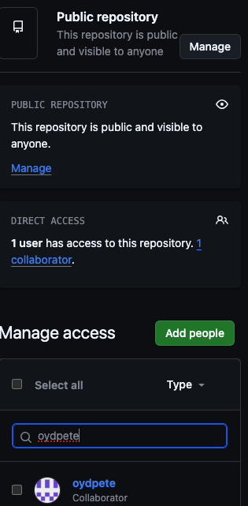
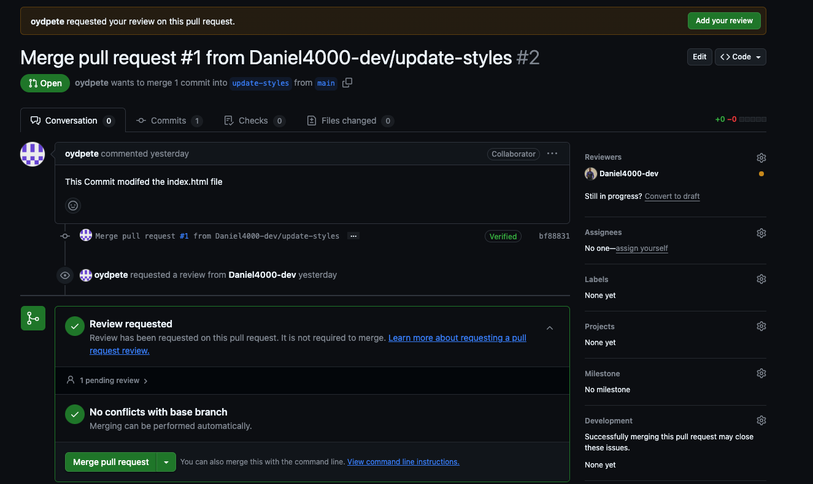
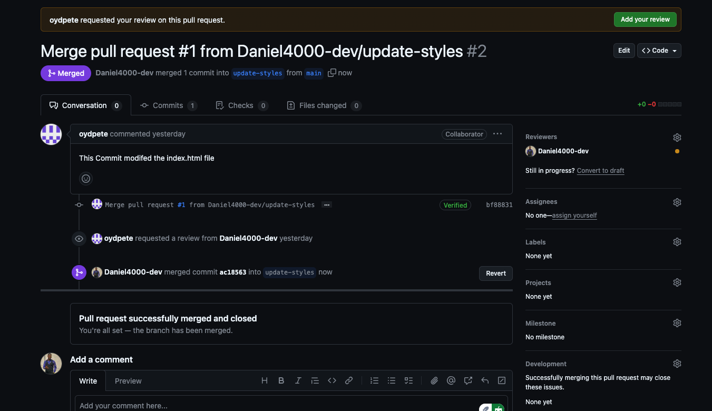

## Team Collaboration

### Create a New Repository and Add collaborator
- Create a repository.
- Go to settings > Collaborators.
- Add a collaborator by username or email ( i used username)



### Create index.html and Push to main
- create file
```bash
touch index.html
```

- Add the following
```html
<!DOCTYPE html>
<html lang="en">
    <head>
        <meta charset="UTF-8">
        <meta http-equiv="X-UA-Compatible" content="IE=edge">
        <meta name="viewport" content="width=device-width, initial-scale=1.0">
        <meta name="description" content="" />
        <title>Welcome to Nexascale</title>
    </head>
    <body>
        <header>
            <h1>Welcome to Nexascale</h1>
        </header>
        <main>
            <div>
                <p>This is a DevSecOps Team Collaboration Project</p>
            </div>
        </main>
        <footer></footer>
    </body>
</html>
```
- Commit and push

```bash
git add index.html
git commit -m "Add index.html"
git push origin main
```
### Merge PR
- After collaborator has implemented his neccessary change and made a PR to main branch
- Merge PR after review





### Pull latest changes
- After pull request has been merged
- pull PR

```bash
git pull origin main
```
